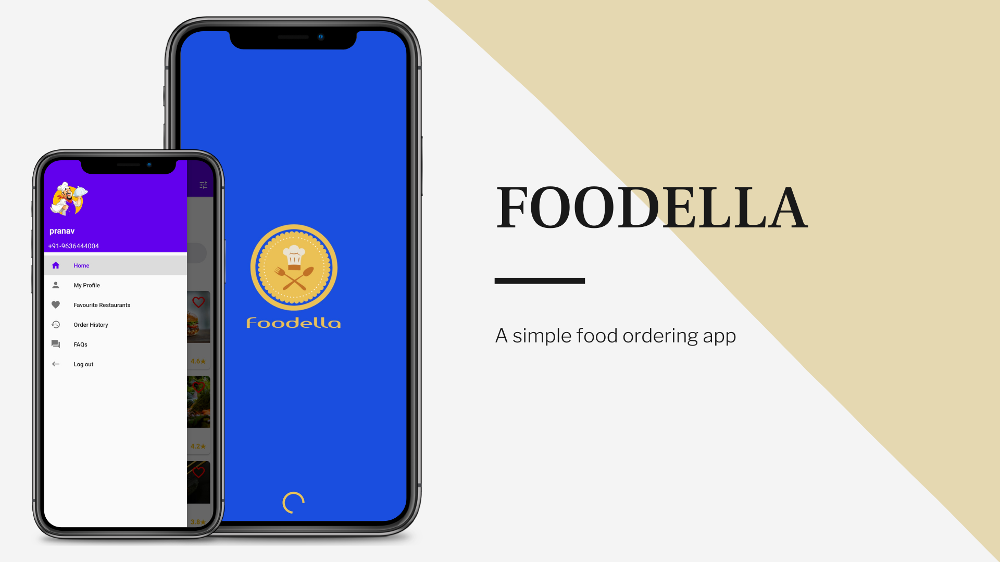
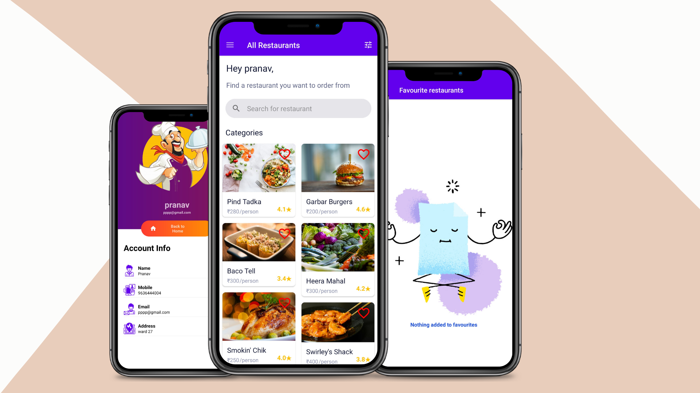
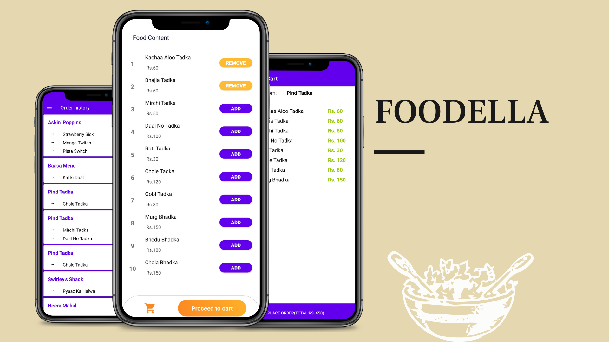

# Foodella

A sample food ordering app. This app is built in kotlin and uses volley to send get and post request from the internshala server through rest api calls.
The app also uses the room persistence library to save data locally.

## Libraries used
<ul>
<li>Room Persistence  Library</li>
<li>Volley</li>
<li>Picasso</li>
</ul>

Functions:
<ul>
<li>
✔️: User registration.</li>
<li>✔️: Filtering Restaurants by price or rating.</li>
<li>✔️:Login as a member</li>
<li>✔️:View food menu</li>
<li>✔️:
Place food orders</li>
<li>✔️: Get a list of similar movies</li>
<li>✔️: Get movie recommendations</li>
<li>✔️: No account creation required</li>
<li>✔️:Browse movies by Genres,In Theaters, Trending, Top-rated, Trending and Upcoming.</li>
</ul>

# Screenshots

NOTE:- Replace your token in "Android->app->res->values->strings"

